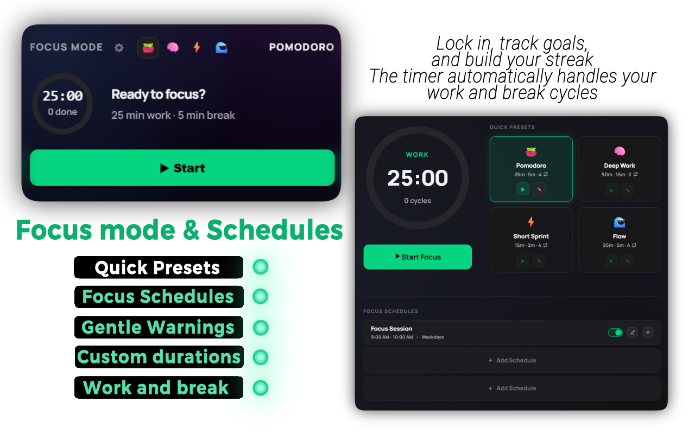
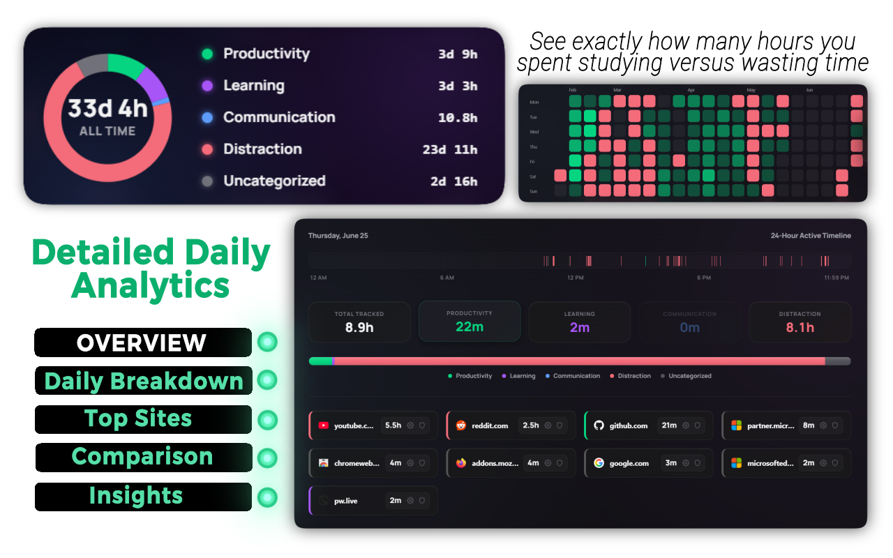
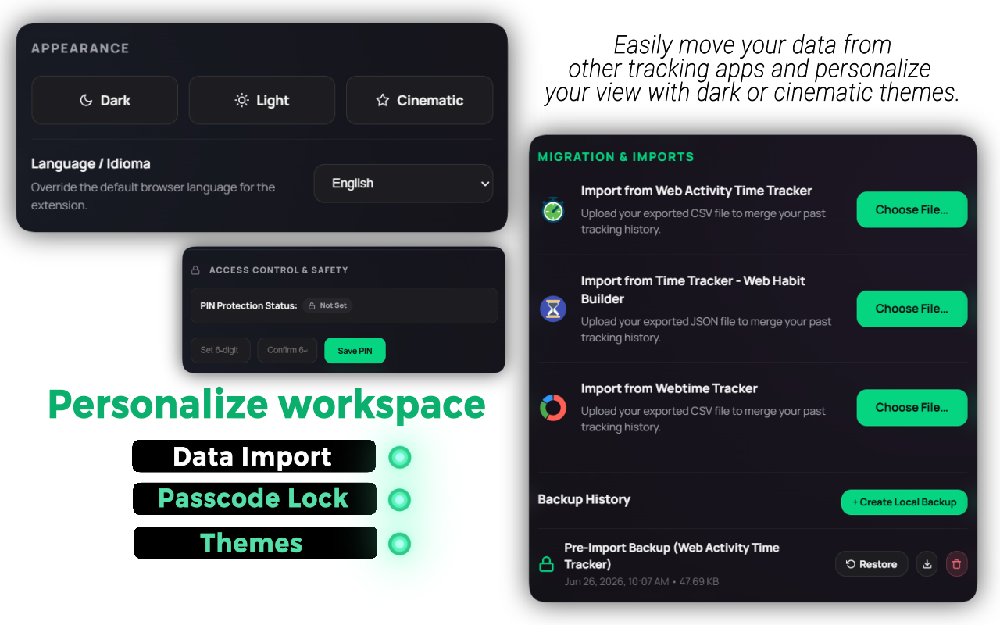

#  Flow &nbsp;&nbsp; <a href="https://chromewebstore.google.com/detail/flow-website-blocker-habi/heinimoclnopjnkpicmonhgichbjejcp"></a> <a href="https://microsoftedge.microsoft.com/addons/detail/jlcdkibfogehgkbhkkkglifbanenkmic"></a> <a href="https://addons.mozilla.org/en-US/firefox/addon/flow-website-blocker/"></a>

**A premium, zero-distraction productivity companion that helps you reclaim your time, build deep focus habits, and block digital noise.**

*Formerly known as FocusFlow.*

*Latest Release: [v10.0.1](CHANGELOG.md)*

🌐 **[Visit the Product Website](https://vishwa-vsr.github.io/flow-website/)**

[](./LICENSE)


---

## ✨ What is Flow?

Flow is a high-end web assistant designed for people who want to work smarter, not longer. It blends a state-of-the-art **Pomodoro Focus Timer** with **Visual Site Analytics**, a **Smart Distraction Blocker**, and a **365-Day Consistency Heatmap** to create the ultimate distraction-free environment.

Whether you are studying, coding, writing, or designing, Flow keeps you in "the zone" while gently helping you build healthier screen-time habits.

**🔒 Privacy first** — All your data is stored locally on your device. Zero tracking, zero data collection.

---

## 🚀 Key Features

| Feature | Description |
|---|---|
| ⏱️ **Premium Pomodoro Timer** | Fully customizable work sessions, short breaks, and long breaks with a glowing ring that fills as your session progresses. |
| 📊 **Visual Time Tracking** | Circular donut chart displays your top-visited websites and shows exactly where your minutes went. |
| 🚫 **Smart Site Blocker** | Network-level blocking with daily time limits, focus schedules, per-session limits, and custom redirects. |
| 🔒 **6-Digit PIN Lock** | Granular locks for Timer Stop, Rule Editing, Free-time Hours, Focus Presets, Schedules, and Settings Danger Zone. |
| 🎯 **Weekly Goals & Streaks** | Set focus targets, track your progress, and earn a glowing streak badge for consecutive days. |
| 🗺️ **365-Day Heatmap** | GitHub-style consistency heatmap with customizable thresholds. Green = focused. Red = wasted. |
| 📈 **Study vs Distraction Trends** | Color-coded trend charts with per-category toggles (Productivity, Learning, Communication, Distraction). |
| 🏷️ **Site Categorization** | Tag every website as Productivity, Learning, Communication, Distraction, or Uncategorized. |
| ⏰ **Focus Schedules** | Set recurring daily/weekly focus sessions that auto-start. |
| 🌗 **Dark, Light & Cinematic Themes** | Three premium themes including a glassmorphic cinematic mode with animated gradient blurs. |
| 🆕 **Custom New Tab Page** | Replace your browser's default blank new tab page with a clean clock, daily widgets, and quick-access stats. |
| 💾 **Data Backup & Import** | Export your rules and history as a JSON file, or import past logs from Webtime Tracker, Time Tracker, and Web Activity Tracker. |

---

## 📸 Screenshots

### 🌊 Product Overview


### ⏱️ Pomodoro Focus Timer & Presets


### 📊 Detailed Daily Analytics & Consistency Heatmap


### 🚫 Smart Site Blocker (Rules & Redirects)


### ⚙️ Personalization, Themes & Backups


---

## 📥 Download

| Store | Version | Rating | User Count |
|---|---|---|---|
| [Firefox Add-ons](https://addons.mozilla.org/en-US/firefox/addon/flow-website-blocker/) | [](https://addons.mozilla.org/en-US/firefox/addon/flow-website-blocker/) | [](https://addons.mozilla.org/en-US/firefox/addon/flow-website-blocker/) | [](https://addons.mozilla.org/en-US/firefox/addon/flow-website-blocker/) |
| [Microsoft Edge Add-ons](https://microsoftedge.microsoft.com/addons/detail/jlcdkibfogehgkbhkkkglifbanenkmic) | [](https://microsoftedge.microsoft.com/addons/detail/jlcdkibfogehgkbhkkkglifbanenkmic) | [](https://microsoftedge.microsoft.com/addons/detail/jlcdkibfogehgkbhkkkglifbanenkmic) | [](https://microsoftedge.microsoft.com/addons/detail/jlcdkibfogehgkbhkkkglifbanenkmic) |
| [Chrome Web Store](https://chromewebstore.google.com/detail/flow-website-blocker-habi/heinimoclnopjnkpicmonhgichbjejcp) | [](https://chromewebstore.google.com/detail/flow-website-blocker-habi/heinimoclnopjnkpicmonhgichbjejcp) | [](https://chromewebstore.google.com/detail/flow-website-blocker-habi/heinimoclnopjnkpicmonhgichbjejcp) | [](https://chromewebstore.google.com/detail/flow-website-blocker-habi/heinimoclnopjnkpicmonhgichbjejcp) |

---

## 🛠️ Manual Installation (Developer Mode)

1. **Download** or clone this repository to your computer.
2. Open your browser and go to the **Extensions** page (`chrome://extensions` or `edge://extensions`).
3. Turn on **Developer mode** (toggle in the top right corner).
4. Click **Load unpacked** and select the `flow-source` folder.
5. **Pin Flow** to your browser toolbar for quick access!

---

## 💻 Source Code & Build Instructions

This repository contains the original, un-minified source code for Flow.

### Build Instructions

To generate the minified code submitted to browser add-on stores:

1. Ensure **Node.js (npm)** is installed on your system.
2. Open a terminal and navigate into the `flow-source` directory.
3. Install the dependencies (like `esbuild`) by running:
   ```bash
   npm install
   ```
4. Run the build script to compile the target folders:
   ```bash
   npm run build
   ```
   *(Note: To build and package the target folders into `.zip` archives for store upload, run `npm run zip` instead. The scripts are interactive by default and will ask you if you want to bump the version number. You can pass the `-y` or `--skip-prompt` flag to bypass these prompts, e.g., `npm run build -- --skip-prompt`.)*
5. The script will create target directories like `flow-dist` (for Chrome), `flow-edge` (for Edge), and `flow-firefox` (for Firefox) containing the final, minified extension code.

### Notes on the Build Process
* The `build.js` script does **not** use complex bundlers like Webpack, Rollup, or Vite.
* It uses `esbuild`'s official JavaScript API to optimize and minify JavaScript and CSS files.
* If `esbuild` (or the `node_modules` folder) is not found, the script gracefully falls back to basic Regular Expressions to strip comments and clean whitespace.
* The code is **not** obfuscated.

---

## 💡 How It Works Under the Hood

* Flow monitors the active tab to calculate time spent on each website.
* When a site is blocked, it uses the `declarativeNetRequest` API for **network-level blocking** — the site never even loads.
* The blocked page shows a cinematic, motivational screen with the specific reason for the block.
* All settings and stats are saved locally using `chrome.storage`, meaning **your browsing data never leaves your device**.

---

## 📋 Changelog

See [CHANGELOG.md](./CHANGELOG.md) for a full list of changes across all versions.

---

## FAQ

#### Does Flow collect my browsing history?
No. Flow is completely local-first. All your browsing activity, settings, and logs are saved on your computer. None of your data is tracked, saved, or sent to external servers.

#### Why does the extension ask for host permissions (site access)?
Flow needs site access to track when you are active on websites so it can calculate your study stats and block distracting pages. Since this process runs locally on your computer, the browser needs permission to run the tracking code on your open tabs.

#### How can I install Flow on Google Chrome?
You can install Flow directly from the [Chrome Web Store](https://chromewebstore.google.com/detail/flow-website-blocker-habi/heinimoclnopjnkpicmonhgichbjejcp). Alternatively, if you want to install it manually, you can download the latest `flow-dist-v10.0.0.zip` file from our Releases page and load it in Developer Mode.

#### How do I backup my settings?
You can manually download a backup of your data from the "Migration & Imports" tab on the options page. We do not use automatic cloud backups to keep your data private and warning-free.

---

## 🤝 Contributing

We welcome contributions of all kinds! Please check out our [Contributing Guide](./CONTRIBUTING.md) to learn how to set up the project locally, submit bug reports, suggest features, or help with translations.

If you like Flow, leaving a 5-star review on the [Firefox Add-ons Store](https://addons.mozilla.org/en-US/firefox/addon/flow-website-blocker/) or the [Edge Add-ons Store](https://microsoftedge.microsoft.com/addons/detail/jlcdkibfogehgkbhkkkglifbanenkmic) is also a massive help!

---

## 📄 License

This project is licensed under the [MIT License](./LICENSE).

---

## 🔗 Links

* [Product Website](https://vishwa-vsr.github.io/flow-website/)
* [Edge Add-on](https://microsoftedge.microsoft.com/addons/detail/jlcdkibfogehgkbhkkkglifbanenkmic)
* [Firefox Add-on](https://addons.mozilla.org/en-US/firefox/addon/flow-website-blocker/)
* [Privacy Policy](./PRIVACY.md)

---

*Made with 💖 by [vishwa-vsr](https://github.com/vishwa-vsr) — Student and indie developer from India.*
