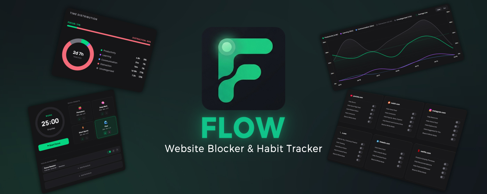
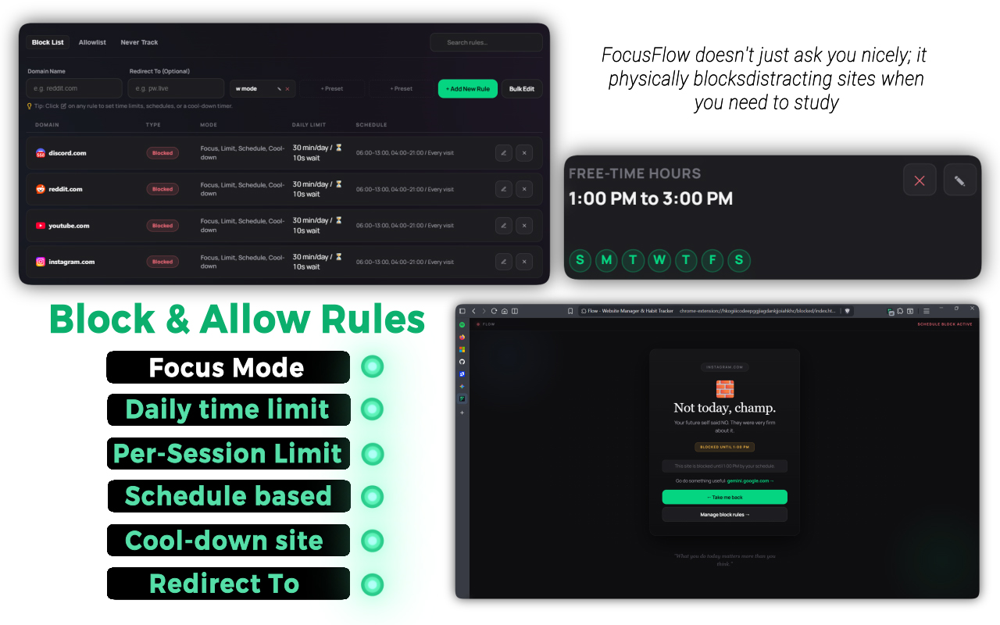

<div align="center">
  
  <h1>Flow</h1>
  <p><b>Flow is a privacy-first web extension that monitors your browsing, blocks distractions, and helps you build deep study habits — all running completely locally.

</b></p>

  <p>
    <a href="https://chromewebstore.google.com/detail/flow-website-blocker-habi/heinimoclnopjnkpicmonhgichbjejcp"></a>
    <a href="https://microsoftedge.microsoft.com/addons/detail/jlcdkibfogehgkbhkkkglifbanenkmic"></a>
    <a href="https://addons.mozilla.org/en-US/firefox/addon/flow-website-blocker/"></a>
  </p>

  <p>
    <a href="https://vishwa-vsr.github.io/flow-website/">🌐 Product Website</a> • 
    <a href="CHANGELOG.md">📄 Changelog</a> • 
    <a href="./LICENSE"></a>
  </p>
  
  <p><i>Formerly known as FocusFlow. Latest Release: <b>v10.0.2</b></i></p>

  <br>
  
  
</div>

---

## ✨ What is Flow?

Flow is a high-end web assistant designed for people who want to work smarter, not longer. It blends a state-of-the-art **Pomodoro Focus Timer** with **Visual Site Analytics**, a **Smart Distraction Blocker**, and a **365-Day Consistency Heatmap** to create the ultimate distraction-free environment.

Whether you are studying, coding, writing, or designing, Flow keeps you in "the zone" while gently helping you build healthier screen-time habits.

**🔒 Privacy first** — All your data is stored locally on your device. Zero tracking, zero data collection.

---

## 🚀 Key Features

| Feature | Description |
| :--- | :--- |
| ⏱️ **Premium Pomodoro Timer** | Fully customizable work sessions, short breaks, and long breaks with a glowing progress ring. |
| 📊 **Visual Time Tracking** | Circular donut chart displays your top-visited websites and shows exactly where your minutes went. |
| 🚫 **Smart Site Blocker** | Network-level blocking with daily time limits, focus schedules, per-session limits, and redirects. |
| 🔒 **6-Digit PIN Lock** | Granular locks for Timer Stop, Rule Editing, Free-time Hours, Focus Presets, and Settings Danger Zone. |
| 🎯 **Weekly Goals & Streaks** | Set focus targets, track your progress, and earn a glowing streak badge for consecutive days. |
| 🗺️ **365-Day Heatmap** | GitHub-style consistency heatmap with customizable focus thresholds. Green = focused. Red = distracted. |
| 📈 **Study vs Distraction Trends** | Color-coded trend charts with category toggles (Productivity, Learning, Communication, Distraction). |
| 🏷️ **Site Categorization** | Tag every website as Productivity, Learning, Communication, Distraction, or Uncategorized. |
| ⏰ **Focus Schedules** | Set recurring daily or weekly focus sessions that automatically govern your browser. |
| 🌗 **Dark, Light & Cinematic Themes** | Premium styling options including a glassmorphic cinematic mode with animated gradient blurs. |
| 💾 **Data Backup & Import** | Export your logs as JSON, or import past data from Webtime Tracker, Time Tracker, and Web Activity Tracker. |

---

## 📸 Screenshots

<div align="center">
  <h3>⏱️ Pomodoro Focus Timer & Presets</h3>
  

  <br><br>

  <h3>📊 Detailed Daily Analytics & Consistency Heatmap</h3>
  

  <br><br>

  <h3>🚫 Smart Site Blocker (Rules & Redirects)</h3>
  

  <br><br>

  <h3>⚙️ Personalization, Themes & Backups</h3>
  
</div>

---

## 📥 Store Details & Downloads

<div align="center">

| Browser Store | Version | Rating | Active Users |
| :--- | :---: | :---: | :---: |
| [Firefox Add-ons Store](https://addons.mozilla.org/en-US/firefox/addon/flow-website-blocker/) | [](https://addons.mozilla.org/en-US/firefox/addon/flow-website-blocker/) | [](https://addons.mozilla.org/en-US/firefox/addon/flow-website-blocker/) | [](https://addons.mozilla.org/en-US/firefox/addon/flow-website-blocker/) |
| [Microsoft Edge Add-ons Store](https://microsoftedge.microsoft.com/addons/detail/jlcdkibfogehgkbhkkkglifbanenkmic) | [](https://microsoftedge.microsoft.com/addons/detail/jlcdkibfogehgkbhkkkglifbanenkmic) | [](https://microsoftedge.microsoft.com/addons/detail/jlcdkibfogehgkbhkkkglifbanenkmic) | [](https://microsoftedge.microsoft.com/addons/detail/jlcdkibfogehgkbhkkkglifbanenkmic) |
| [Chrome Web Store](https://chromewebstore.google.com/detail/flow-website-blocker-habi/heinimoclnopjnkpicmonhgichbjejcp) | [](https://chromewebstore.google.com/detail/flow-website-blocker-habi/heinimoclnopjnkpicmonhgichbjejcp) | [](https://chromewebstore.google.com/detail/flow-website-blocker-habi/heinimoclnopjnkpicmonhgichbjejcp) | [](https://chromewebstore.google.com/detail/flow-website-blocker-habi/heinimoclnopjnkpicmonhgichbjejcp) |

</div>

---

## 🛠️ Manual Installation (Developer Mode)

1. **Download** or clone this repository to your computer.
2. Open your browser and navigate to the **Extensions** page:
   * Google Chrome: `chrome://extensions`
   * Microsoft Edge: `edge://extensions`
3. Toggle on **Developer mode** in the top right corner.
4. Click **Load unpacked** in the top left corner.
5. Select the `src` folder (to run raw, unminified code) or the `flow-dist` folder (if you ran the build script) from the files you downloaded.
6. **Pin Flow** to your browser toolbar for quick access!

---

## 📂 Repository File Structure

To help contributors understand where files are located, here is the organized layout of the repository:

```text
flow-source/
  ├── src/                         <-- ALL extension code goes here!
  │    ├── manifest.json           <-- Extension configurations
  │    ├── _locales/               <-- Localized translation files
  │    ├── assets/                 <-- Media assets (fonts, icons)
  │    │    ├── fonts/
  │    │    └── icons/
  │    ├── styles/
  │    │    └── global.css         <-- Core shared design CSS tokens
  │    ├── background/             <-- Service workers (tab tracking, blocking)
  │    ├── content/                <-- Content script tracking site focus
  │    ├── lib/                    <-- Helper scripts (constants, db, storage)
  │    ├── blocked/                <-- Refined blocked page layout
  │    ├── dashboard/              <-- Premium visual statistics screen
  │    ├── popup/                  <-- Main dropdown focus timer card
  │    └── utils.js                <-- DOM/UI interface helper functions
  ├── tools/
  │    ├── build.js                <-- Standard optimized minifier builder
  │    ├── languages_analysis.html <-- Translation stats checking interface
  │    ├── languages_analysis.py   <-- Translation statistics checking tool
  │    └── translate_locales.py    <-- Machine translator utility helper
  ├── media/                       <-- Marketing posters and preview banners
  │    ├── flow_preview6.jpg
  │    └── ...
  ├── .gitignore                 
  ├── package.json               
  ├── README.md                  
  └── CONTRIBUTING.md            
```

---

## 💻 Source Code & Build Instructions

This repository contains the original, un-minified source code for Flow.

### Build Instructions

To generate the minified production packages submitted to browser extension stores:

1. Ensure **Node.js (npm)** is installed on your computer.
2. Open a terminal and navigate into the `flow-source` directory.
3. Install the developer dependencies:
   ```bash
   npm install
   ```
4. Run the build script:
   ```bash
    npm run build
    ```

> [!TIP]
> To package the target folders into `.zip` archives for store uploads, run `npm run zip` instead. Bypassing prompts can be done via the `--yes` flag: `npm run build -- --yes`.

> [!WARNING]
> **Windows Users**: If PowerShell blocks running the npm command due to script policies, run the build script directly with Node: `node tools/build.js --yes`, or bypass execution policies with `powershell -ExecutionPolicy Bypass -Command "npm run build"`.

5. The build script outputs optimized builds into `flow-dist/` (for Chrome), `flow-edge/` (for Edge), and `flow-firefox/` (for Firefox).

### Notes on the Build Process
* The build script (`tools/build.js`) does **not** rely on complex bundlers.
* It uses `esbuild`'s official API to optimize and minify JavaScript and CSS files.
* If `esbuild` is not found, the script gracefully falls back to regex-based comment and whitespace cleanup.

---

## 💡 How It Works Under the Hood

* **Active Time Tracking**: Flow monitors active tabs and system idle states to log exactly how long you stay on each site.
* **Network-Level Blocking**: Distracting sites are blocked using Chrome's native `declarativeNetRequest` engine, meaning blocked pages never load or consume network bandwidth.
* **Local-First Privacy**: All stats, rules, and tracking data are stored strictly on your local machine using Chrome's local storage database.

---

## ❓ FAQ

<details>
  <summary><b>Does Flow collect my browsing history?</b></summary>
  <br>
  No. Flow is completely local-first. All your browsing activity, settings, and logs are saved on your computer. None of your data is tracked, saved, or sent to external servers.
</details>

<details>
  <summary><b>Why does the extension ask for site access permissions?</b></summary>
  <br>
  Flow needs site access to track when you are active on websites so it can calculate your study stats and block distracting pages. Since this process runs locally on your computer, the browser needs permission to run the tracking code on your open tabs.
</details>

<details>
  <summary><b>How can I install Flow on Google Chrome?</b></summary>
  <br>
  You can install Flow directly from the <a href="https://chromewebstore.google.com/detail/flow-website-blocker-habi/heinimoclnopjnkpicmonhgichbjejcp">Chrome Web Store</a>. Alternatively, if you want to install it manually, you can download the latest <code>flow-dist-v10.0.1.zip</code> file from our Releases page and load it in Developer Mode.
</details>

<details>
  <summary><b>How do I backup my settings?</b></summary>
  <br>
  You can manually download a backup of your data from the "Migration & Imports" tab on the options page. We do not use automatic cloud backups to keep your data private and warning-free.
</details>

---

## 🤝 Contributing

We welcome contributions of all kinds! Please check out our [Contributing Guide](./CONTRIBUTING.md) to learn how to set up the project locally, submit bug reports, suggest features, or help with translations.

If you like Flow, leaving a 5-star review on the [Chrome Web Store](https://chromewebstore.google.com/detail/flow-website-blocker-habi/heinimoclnopjnkpicmonhgichbjejcp), [Firefox Add-ons Store](https://addons.mozilla.org/en-US/firefox/addon/flow-website-blocker/), or the [Edge Add-ons Store](https://microsoftedge.microsoft.com/addons/detail/jlcdkibfogehgkbhkkkglifbanenkmic) is also a massive help!

---

## 💖 Credits & Third-Party Resources

Flow is made possible thanks to these amazing open-source libraries, typefaces, and assets:

* **[Chart.js](https://www.chartjs.org/)** — Used under the [MIT License](https://github.com/chartjs/Chart.js/blob/master/LICENSE.md) to render the premium analytics charts.
* **[Manrope Font](https://github.com/sharanda/manrope)** — Mikhail Sharanda's modern geometric sans-serif typeface, used under the [SIL Open Font License 1.1](./src/assets/fonts/LICENSE.txt).
* **Migration Brand Assets** — Logos for *Web Activity Time Tracker*, *Time Tracker*, and *Webtime Tracker* are used strictly for nominative identification of import options. All trademarks and brand names are properties of their respective owners.

---

## 📄 License

This project is licensed under the [MIT License](./LICENSE).

---

<div align="center">
  <p><b>🔗 Quick Links:</b> <a href="https://vishwa-vsr.github.io/flow-website/">Product Website</a> • <a href="https://chromewebstore.google.com/detail/flow-website-blocker-habi/heinimoclnopjnkpicmonhgichbjejcp">Chrome Web Store</a> • <a href="https://microsoftedge.microsoft.com/addons/detail/jlcdkibfogehgkbhkkkglifbanenkmic">Edge Add-on</a> • <a href="https://addons.mozilla.org/en-US/firefox/addon/flow-website-blocker/">Firefox Add-on</a> • <a href="./PRIVACY.md">Privacy Policy</a></p>

  <hr style="width: 50%;">

  <p><i>Made with 💖 by <a href="https://github.com/vishwa-vsr">vishwa-vsr</a> — Student and indie developer from India.</i></p>
</div>
