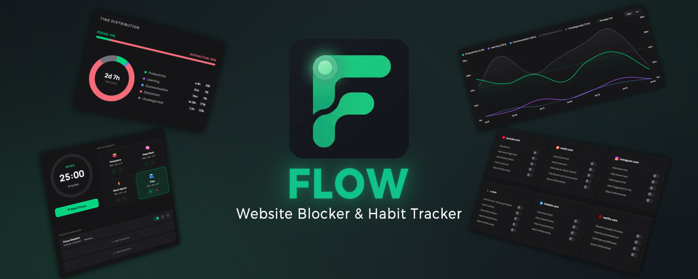
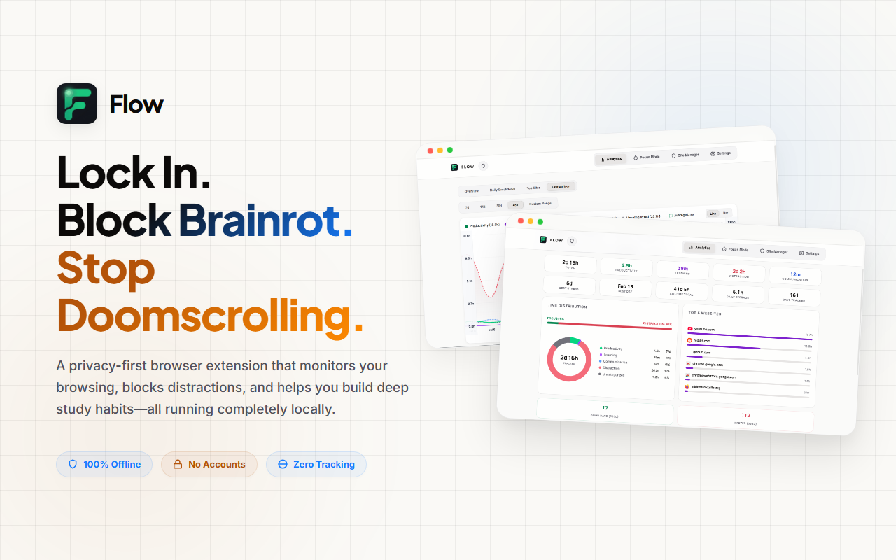
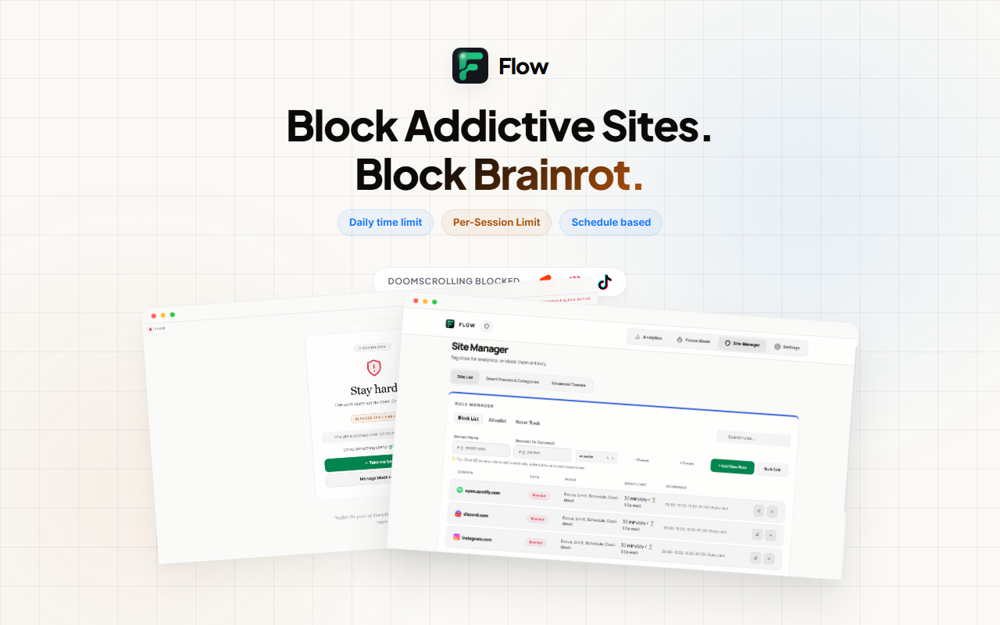
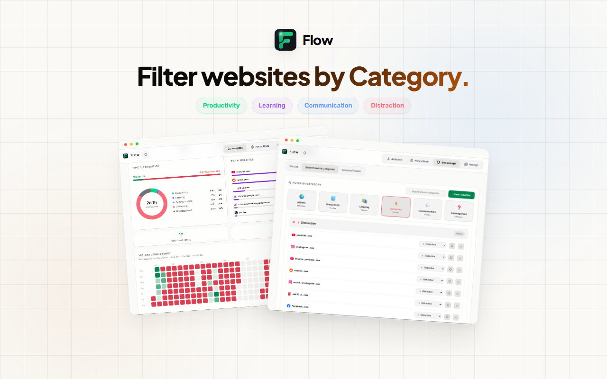
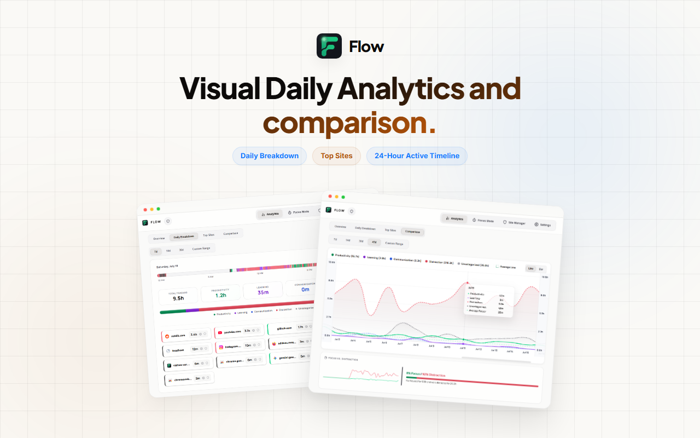

<div align="center">
  
  <h1>Flow</h1>
  <p><b>Flow is a privacy-first web extension that monitors your browsing, blocks distractions, and helps you build deep study habits — all running completely locally.

</b></p>

  <p>
    <a href="https://chromewebstore.google.com/detail/flow-website-blocker-habi/heinimoclnopjnkpicmonhgichbjejcp"></a>
    <a href="https://microsoftedge.microsoft.com/addons/detail/jlcdkibfogehgkbhkkkglifbanenkmic"></a>
    <a href="https://addons.mozilla.org/en-US/firefox/addon/flow-website-blocker/"></a>
  </p>

  <p>
    <a href="https://github.com/vishwa-vsr/Flow/stargazers"></a>
    <a href="https://github.com/vishwa-vsr/Flow/issues"></a>
    <a href="https://github.com/vishwa-vsr/Flow/graphs/contributors"></a>
    <a href="https://github.com/vishwa-vsr/Flow/releases"></a>
  </p>

  <p>
    <a href="https://vishwa-vsr.github.io/flow-website/">🌐 Product Website</a> • 
    <a href="CHANGELOG.md">📄 Changelog</a> • 
    <a href="./LICENSE"></a>
  </p>
  
  <p><i>Formerly known as FocusFlow. Latest Release: <b>v10.1.0</b></i></p>

  <br>
  
  
</div>

---

## ✨ What is Flow?

Flow is a browser extension I built because I was spending 4+ hours a day on YouTube and Reddit instead of studying. It combines a **website blocker**, **screen time tracker**, and **Pomodoro focus timer** into one tool — with all your data staying 100% on your computer.

Whether you're studying for exams, coding on a deadline, or just trying to stop doomscrolling — Flow helps you see where your time goes and take control of it.

**🔒 Privacy first** — All data is stored locally. Zero tracking, zero data collection, zero accounts required.

**💸 100% free** — No premium tier, no subscriptions, no ads. Ever.

---

## 🚀 Key Features

| Feature | Description |
| :--- | :--- |
| ⏱️ **Pomodoro Focus Timer** | Customizable work sessions, breaks, and quick presets (Deep Work, Short Sprint). Auto-blocks distracting sites during focus. |
| 📊 **Visual Time Tracking** | See exactly where your hours go with daily breakdowns, category splits, and top-site rankings. |
| 🚫 **Smart Site Blocker** | Block any website with daily limits, per-session limits, schedule-based blocks, or instant blocks. |
| 🌐 **Multi-Language Support** | Fully localized user interface across 11 languages (English, Spanish, Simplified Chinese, Traditional Chinese HK/TW, Japanese, German, Brazilian Portuguese, French, Korean, and Russian). |
| 🔒 **6-Digit PIN Lock** | Prevent self-cheating by locking rule edits, timer stops, and settings behind a PIN code. |
| 🎯 **Weekly Goals & Streaks** | Set focus hour targets, track daily streaks, and earn visual badges for consistency. |
| 🗺️ **365-Day Consistency Heatmap** | GitHub-style yearly heatmap to visualize your study habits. Greener = focused, red = wasted. |
| 📈 **Study vs Distraction Trends** | Color-coded breakdown comparing productive study hours against leisure and distraction time. |
| 🏷️ **Site Categorization** | Tag websites as Productivity, Learning, Communication, Distraction, or Uncategorized. |
| ⏰ **Focus Schedules** | Automate your routine with recurring daily or weekly blocking schedules. |
| 🌗 **Dark & Light Themes** | Clean theme options including a dark OLED mode and a clean light mode. |
| 💾 **Data Backup & Import** | 100% offline data export (JSON), plus one-click history migration from other time-tracker extensions. |

---

## 🤔 Why Flow over alternatives?

| Feature | Flow | BlockSite | StayFocusd | Freedom | Forest |
| :--- | :---: | :---: | :---: | :---: | :---: |
| **100% Free & Open-Source** | ✅ | ❌ Paid Tier | ⚠️ Free / Closed | ❌ Paid | ❌ Paid |
| **100% Local & Private** | ✅ | ❌ Cloud / Tracking | ✅ | ❌ Cloud | ❌ Cloud |
| **No Account Required** | ✅ | ❌ Required | ✅ | ❌ Required | ❌ Required |
| **Screen Time Tracking** | ✅ | ❌ | ❌ | ❌ | ❌ |
| **Pomodoro Focus Timer** | ✅ | ❌ | ❌ | ❌ | ✅ |
| **Distraction Feeds Hider** | ✅ | ❌ | ❌ | ❌ | ❌ |
| **365-Day Consistency Heatmap** | ✅ | ❌ | ❌ | ❌ | ❌ |
| **6-Digit PIN Lock** | ✅ | ❌ Paid Tier | ❌ | ✅ | ❌ |
| **Multi-Browser Support** | ✅ | ✅ | ❌ Chrome only | ✅ | ✅ |

### The Competitive Landscape (2×2 Matrix)

```text
                 High Price / Subscriptions
                      │
                      │      [Freedom.to]
                      │
                      │                 [Momentum]
                      │
    [Cold Turkey]     │      [BlockSite]
──────────────────────┼────────────────────── Modern & Clean UI
    [StayFocusd]      │
                      │    ★ FLOW (100% Free, Private & Open-Source)
                      │
    [Webtime Tracker] │
                      │
                 100% Free / Open-Source
```

---

## 📸 Screenshots

<div align="center">
  <h3>🚀 Lock In. Block Distractions. Stop Doomscrolling.</h3>
  

  <br><br>

  <h3>🚫 Smart Site Blocker (Rules & Time Limits)</h3>
  

  <br><br>

  <h3>🏷️ Website Categorization & Usage Breakdown</h3>
  

  <br><br>

  <h3>📈 Visual Daily Analytics & Trend Comparison</h3>
  
</div>

---

## 📥 Store Details & Downloads

<div align="center">

| Browser Store | Version | Rating | Active Users |
| :--- | :---: | :---: | :---: |
| [Firefox Add-ons Store](https://addons.mozilla.org/en-US/firefox/addon/flow-website-blocker/) | [](https://addons.mozilla.org/en-US/firefox/addon/flow-website-blocker/) | [](https://addons.mozilla.org/en-US/firefox/addon/flow-website-blocker/) | [](https://addons.mozilla.org/en-US/firefox/addon/flow-website-blocker/) |
| [Microsoft Edge Add-ons Store](https://microsoftedge.microsoft.com/addons/detail/jlcdkibfogehgkbhkkkglifbanenkmic) | [](https://microsoftedge.microsoft.com/addons/detail/jlcdkibfogehgkbhkkkglifbanenkmic) | [](https://microsoftedge.microsoft.com/addons/detail/jlcdkibfogehgkbhkkkglifbanenkmic) | [](https://microsoftedge.microsoft.com/addons/detail/jlcdkibfogehgkbhkkkglifbanenkmic) |
| [Chrome Web Store](https://chromewebstore.google.com/detail/flow-website-blocker-habi/heinimoclnopjnkpicmonhgichbjejcp) | [](https://chromewebstore.google.com/detail/flow-website-blocker-habi/heinimoclnopjnkpicmonhgichbjejcp) | [](https://chromewebstore.google.com/detail/flow-website-blocker-habi/heinimoclnopjnkpicmonhgichbjejcp) | [](https://chromewebstore.google.com/detail/flow-website-blocker-habi/heinimoclnopjnkpicmonhgichbjejcp) |

</div>

---

## 🛠️ Manual Installation (Developer Mode)

1. **Download** or clone this repository to your computer.
2. Open your browser and navigate to the **Extensions** page:
   * Google Chrome: `chrome://extensions`
   * Microsoft Edge: `edge://extensions`
3. Toggle on **Developer mode** in the top right corner.
4. Click **Load unpacked** in the top left corner.
5. Select the `src` folder (to run raw, unminified code) or the `dist/chrome` folder (if you ran the build script) from the files you downloaded.
6. **Pin Flow** to your browser toolbar for quick access!

---

## 📂 Repository File Structure

To help contributors understand where files are located, here is the organized layout of the repository:

```text
flow-source/
  ├── src/                         <-- Extension source code
  │    ├── manifest.json           <-- Extension configuration & permissions
  │    ├── _locales/               <-- 11 localized translation packages
  │    ├── assets/                 <-- Typography fonts and app icons
  │    │    ├── fonts/
  │    │    └── icons/
  │    ├── styles/
  │    │    └── global.css         <-- Core shared design tokens & variables
  │    ├── background/             <-- Service worker (tab tracking, rule engine, alarms)
  │    ├── content/                <-- Content scripts (site activity & UI tweaks)
  │    ├── lib/                    <-- Shared libraries (storage, IndexedDB, icons manager)
  │    ├── blocked/                <-- Blocked site overlay page
  │    ├── dashboard/              <-- Full-page analytics dashboard & settings
  │    └── popup/                  <-- Toolbar dropdown timer and quick stats
  ├── dist/                        <-- Compiled browser builds (Chrome, Edge, Firefox)
  ├── release/                     <-- Packaged store-ready zip archives
  ├── docs/                        <-- Project roadmaps & feedback notes (local dev)
  ├── tools/                       <-- Build script (build.js) and translation utilities
  ├── media/                       <-- Store screenshots and preview banners
  ├── .gitignore                 
  ├── package.json               
  ├── README.md                  
  └── CONTRIBUTING.md            
```

---

## 💻 Source Code & Build Instructions

This repository contains the original, un-minified source code for Flow.

### Build Instructions

To generate the minified production packages submitted to browser extension stores:

1. Ensure **Node.js (npm)** is installed on your computer.
2. Open a terminal and navigate into the `flow-source` directory.
3. Install the developer dependencies:
   ```bash
   npm install
   ```
4. Run the build script:
   ```bash
    npm run build
    ```

> [!TIP]
> To package the target folders into `.zip` archives for store uploads, run `npm run zip` instead. Bypassing prompts can be done via the `--yes` flag: `npm run build -- --yes`.

> [!WARNING]
> **Windows Users**: If PowerShell blocks running the npm command due to script policies, run the build script directly with Node: `node tools/build.js --yes`, or bypass execution policies with `powershell -ExecutionPolicy Bypass -Command "npm run build"`.

5. The build script outputs optimized builds into `dist/chrome/` (for Chrome), `dist/edge/` (for Edge), and `dist/firefox/` (for Firefox), and saves packaged `.zip` files in `release/`.

### Notes on the Build Process
* The build script (`tools/build.js`) does **not** rely on complex bundlers.
* It uses `esbuild`'s official API to optimize and minify JavaScript and CSS files.
* If `esbuild` is not found, the script gracefully falls back to regex-based comment and whitespace cleanup.

---

## 💡 How It Works Under the Hood

* **Active Time Tracking**: Flow monitors active tabs and system idle states to log exactly how long you stay on each site.
* **Network-Level Blocking**: Distracting sites are blocked using Chrome's native `declarativeNetRequest` engine, meaning blocked pages never load or consume network bandwidth.
* **Local-First Privacy**: All stats, rules, and tracking data are stored strictly on your local machine using Chrome's local storage database.

---

## ❓ FAQ

<details>
  <summary><b>Does Flow collect my browsing history?</b></summary>
  <br>
  No. Flow is completely local-first. All your browsing activity, settings, and logs are saved on your computer. None of your data is tracked, saved, or sent to external servers.
</details>

<details>
  <summary><b>Why does the extension ask for site access permissions?</b></summary>
  <br>
  Flow needs site access to track when you are active on websites so it can calculate your study stats and block distracting pages. Since this process runs locally on your computer, the browser needs permission to run the tracking code on your open tabs.
</details>

<details>
  <summary><b>How can I install Flow on Google Chrome?</b></summary>
  <br>
  You can install Flow directly from the <a href="https://chromewebstore.google.com/detail/flow-website-blocker-habi/heinimoclnopjnkpicmonhgichbjejcp">Chrome Web Store</a>. Alternatively, if you want to install it manually, you can download the latest package from our <a href="https://github.com/vishwa-vsr/Flow/releases">Releases page</a> and load it in Developer Mode.
</details>

<details>
  <summary><b>How do I backup my settings?</b></summary>
  <br>
  You can manually download a backup of your data from the "Migration & Imports" tab on the options page. We do not use automatic cloud backups to keep your data private and warning-free.
</details>

---

## 🤝 Contributing

We welcome contributions of all kinds! Please check out our [Contributing Guide](./CONTRIBUTING.md) to learn how to set up the project locally, submit bug reports, suggest features, or help with translations.

If you like Flow, leaving a 5-star review on the [Chrome Web Store](https://chromewebstore.google.com/detail/flow-website-blocker-habi/heinimoclnopjnkpicmonhgichbjejcp), [Firefox Add-ons Store](https://addons.mozilla.org/en-US/firefox/addon/flow-website-blocker/), or the [Edge Add-ons Store](https://microsoftedge.microsoft.com/addons/detail/jlcdkibfogehgkbhkkkglifbanenkmic) is also a massive help!

## 👥 Contributors

<a href="https://github.com/vishwa-vsr/Flow/graphs/contributors">
  
</a>

<p>Want to see your face here? Check out our <a href="./CONTRIBUTING.md">Contributing Guide</a>!</p>

---

## 💖 Credits & Third-Party Resources

Flow is made possible thanks to these amazing open-source libraries, typefaces, and assets:

* **[Chart.js](https://www.chartjs.org/)** — Used under the [MIT License](https://github.com/chartjs/Chart.js/blob/master/LICENSE.md) to render the premium analytics charts.
* **[Manrope Font](https://github.com/sharanda/manrope)** — Mikhail Sharanda's modern geometric sans-serif typeface, used under the [SIL Open Font License 1.1](./src/assets/fonts/LICENSE.txt).
* **Migration Brand Assets** — Logos for *Web Activity Time Tracker*, *Time Tracker*, and *Webtime Tracker* are used strictly for nominative identification of import options. All trademarks and brand names are properties of their respective owners.

---

## 📄 License

This project is licensed under the [GNU General Public License v3.0 (GPLv3)](./LICENSE).

---

<div align="center">
  <p><b>🔗 Quick Links:</b> <a href="https://vishwa-vsr.github.io/flow-website/">Product Website</a> • <a href="https://chromewebstore.google.com/detail/flow-website-blocker-habi/heinimoclnopjnkpicmonhgichbjejcp">Chrome Web Store</a> • <a href="https://microsoftedge.microsoft.com/addons/detail/jlcdkibfogehgkbhkkkglifbanenkmic">Edge Add-on</a> • <a href="https://addons.mozilla.org/en-US/firefox/addon/flow-website-blocker/">Firefox Add-on</a> • <a href="./PRIVACY.md">Privacy Policy</a></p>

  <hr style="width: 50%;">

  <p><i>Made with 💖 by <a href="https://github.com/vishwa-vsr">vishwa-vsr</a> — Student and indie developer from India.</i></p>
</div>
